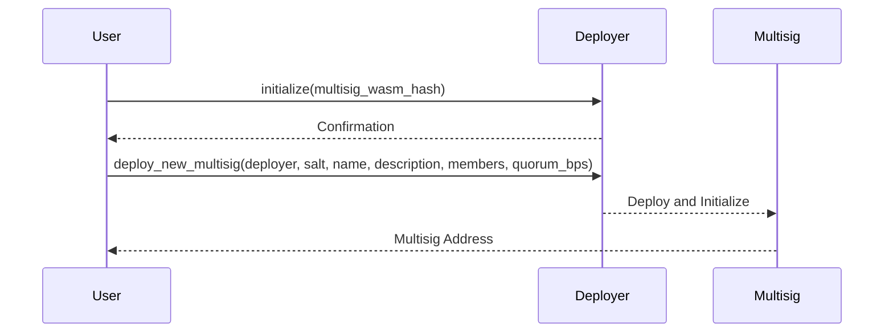
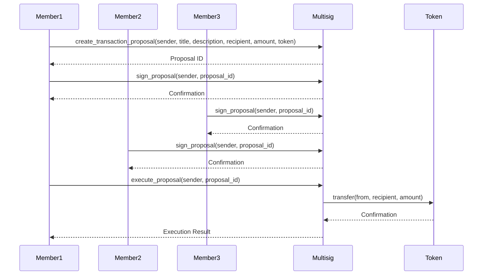

# Multisig Smart Contract Documentation

## Overview
This documentation provides a detailed guide for the Multisig smart contract on the Stellar network, including two primary contracts: `Deployer` and `Multisig`. It covers initialization, deployment, and proposal creation.

## Contracts

### Deployer Contract
The Deployer contract is responsible for initializing and deploying new Multisig contracts.

#### `initialize`
- **Parameters:**
  - `env`: The environment in which the contract is executed.
  - `multisig_wasm_hash`: The hash of the Multisig WASM binary.

#### `deploy_new_multisig`
- **Parameters:**
  - `env`: The environment in which the contract is executed.
  - `deployer`: The address of the deployer.
  - `salt`: A unique salt for deployment.
  - `name`: The name of the Multisig contract.
  - `description`: The description of the Multisig contract.
  - `members`: A vector of addresses representing the members of the Multisig.
  - `quorum_bps`: An optional quorum in basis points (bps).

### Multisig Contract
The Multisig contract handles the creation, signing, and execution of proposals.

#### `initialize`
- **Parameters:**
  - `env`: The environment in which the contract is executed.
  - `name`: The name of the Multisig.
  - `description`: The description of the Multisig.
  - `members`: A vector of addresses representing the members.
  - `quorum_bps`: An optional quorum in basis points (bps).

#### `create_transaction_proposal`
- **Parameters:**
  - `env`: The environment in which the contract is executed.
  - `sender`: The address of the proposal creator.
  - `title`: The title of the proposal.
  - `description`: The description of the proposal.
  - `recipient`: The recipient address of the transaction.
  - `amount`: The amount to be transferred.
  - `token`: The token address.
  - `expiration_date`: Option<u64> The expiration date after the creation of the proposal. If `None` is set then 7 days will be placed automatically.

#### `create_update_proposal`
- **Parameters:**
  - `env`: The environment in which the contract is executed.
  - `sender`: The address of the proposal creator.
  - `new_wasm_hash`: The new WASM hash.
  - `expiration_date`: Option<u64> The expiration date after the creation of the proposal. If `None` is set then 7 days will be placed automatically.

#### `sign_proposal`
- **Parameters:**
  - `env`: The environment in which the contract is executed.
  - `sender`: The address of the signer.
  - `proposal_id`: The ID of the proposal.

#### `execute_proposal`
- **Parameters:**
  - `env`: The environment in which the contract is executed.
  - `sender`: The address of the executor.
  - `proposal_id`: The ID of the proposal.

#### `remove_proposal`
- **Parameters:**
  - `env`: The environment in which the contract is executed.
  - `sender`: The address of the remover.
  - `proposal_id`: The ID of the proposal.

#### `query_multisig_info`
- **Parameters:**
  - `env`: The environment in which the contract is executed.

## Deployment and Initialization

## Example workflow

### Create and Execute a Proposal

